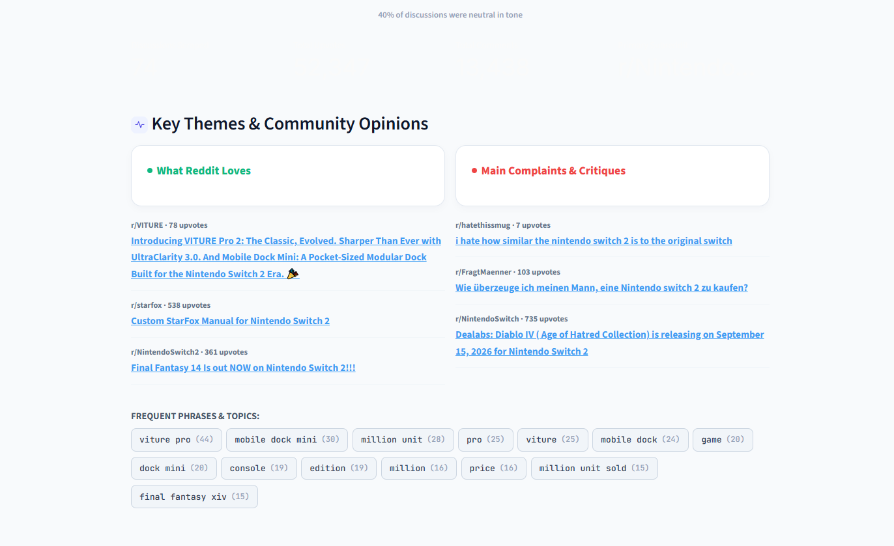
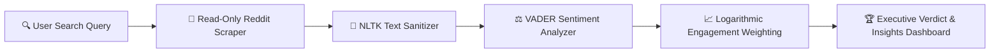

<div align="center">

  # ⚡ Reddit's Feelings

  ### *Skip the endless scrolling — see what Reddit really thinks.*

  <br />

  [](https://reddits-feelings.streamlit.app/)

  <br />

  [](https://reddits-feelings.streamlit.app/)
  [](https://python.org)
  [](https://praw.readthedocs.io)
  [](https://www.nltk.org)
  [](LICENSE)

</div>

<br />

> [!TIP]
> 🚀 **LIVE DEMO AVAILABLE**: Try **Reddit's Feelings** instantly in your browser at **[reddits-feelings.streamlit.app](https://reddits-feelings.streamlit.app/)** — no installation, local setup, or API keys required!

---

## 📌 Overview

Ever wondered how Reddit feels about something? Trying a product, researching a topic, or curious what people think about a person? 

**Reddit's Feelings** (or *Redditors Feelings*) is an intelligent sentiment consensus engine that analyzes Reddit in real-time. Simply enter any product, brand, media, or name, and the app scans hundreds of community discussions, extracts sentiment vectors, weights opinions by community engagement (upvotes + comments), and delivers a definitive **0–100 Verdict Score** alongside key themes and critical feedback.

👉 **Experience it live right now at [reddits-feelings.streamlit.app](https://reddits-feelings.streamlit.app/)**

---

## 📸 Product Preview & Screenshots

<div align="center">

### 1. Favorable Consensus (e.g., *Nintendo Switch 2*)

*Executive verdict badge, 0–100 sentiment score, and two-tone sentiment distribution breakdown.*

---

### 2. Mixed / Balanced Consensus (e.g., *Elon Musk*)

*Real-time sentiment scoring for controversial or multi-faceted topics with neutral weighting.*

---

### 3. Key Themes, Evidence Feed & Topic Mining

*Curated 'What Reddit Loves' vs. 'Main Complaints', linked discussion cards with upvote counts, and N-gram frequent phrase chips.*

</div>

---

## ✨ Key Features

- **🌐 Live Web App**: Accessible 24/7 at **[reddits-feelings.streamlit.app](https://reddits-feelings.streamlit.app/)**.
- **🎯 0–100 Community Verdict Score**: Replaces ambiguous sentiment metrics with a clear, single index score ranging from *Overwhelmingly Negative* to *Overwhelmingly Positive*.
- **📊 Engagement-Weighted Scoring**: Posts with higher upvotes and comment volume carry logarithmic weight, ensuring top community voices shape the verdict over noise.
- **🏷️ Key Theme Extraction**: Automatically classifies posts into *What Reddit Loves* (Positive highlights) and *Main Complaints & Critiques* (Negative highlights).
- **🔤 Frequent Phrase Mining**: Extracts unigrams, bigrams, and trigrams across discussions to highlight recurring keywords and hot topics.
- **🔒 Privacy-First & Read-Only**: Authenticates strictly using Reddit's application-only credentials (`read_only = True`). No user account login is ever needed.
- **🎨 Modern Slate & Glass Design**: Custom CSS design system built on Streamlit with smooth cards, status badges, JetBrains Mono keyphrase chips, and zero clutter.

---

## 🧠 How It Works & Architecture



1. **Precision Retrieval**: Searches Reddit public discussions using exact phrase matching and fallback keyword expansion across selected subreddits and time windows.
2. **Text Sanitation**: Strips URLs, markdown formatting, punctuation, and standard + custom stop words while preserving raw text for VADER polarity evaluation.
3. **Sentiment & Weight Vector**:
   Each post $i$ is assigned a VADER compound polarity score $S_i \in [-1, 1]$ and an engagement weight $W_i$:
   $$W_i = 1 + \ln(1 + \text{Upvotes}_i + \text{Comments}_i)$$
   The overall weighted compound score $\bar{S}$ is mapped to a **0–100 Index**:
   $$\text{Sentiment Index} = \left\lfloor \frac{\bar{S} + 1}{2} \times 100 \right\rceil$$
4. **Insight Synthesis**: Aggregates positive/negative sentiment shares, mines N-gram frequencies, and renders linked evidence cards sorted by upvote traction.

---

## 🛠️ Tech Stack

| Domain | Technology / Library | Purpose |
|---|---|---|
| **Live App Hosting** | [Streamlit Community Cloud](https://reddits-feelings.streamlit.app/) | Instant production deployment & public availability |
| **Frontend UI** | [Streamlit 1.37+](https://streamlit.io) | Dynamic responsive web application interface |
| **API Integration** | [PRAW 7.7](https://praw.readthedocs.io) | Read-only Python Reddit API Wrapper |
| **NLP & Sentiment** | [NLTK](https://www.nltk.org) (VADER + WordNet) | Polarity scoring, lemmatization, and phrase extraction |
| **Data Processing** | [Pandas](https://pandas.pydata.org) & [NumPy](https://numpy.org) | Data structuring, metric aggregation, and filtering |
| **Visualization** | [Plotly](https://plotly.com/python/) | Custom styled charts and indicator graphics |
| **Configuration** | [python-dotenv](https://github.com/theskumar/python-dotenv) | Environment variable configuration for credentials |

---

## 📂 Project Structure

```text
Reddit's Feelings/
├── app.py              # Main Streamlit UI, styling, layout & search orchestration
├── nlp_pipeline.py     # NLTK cleaning, VADER scoring, N-gram mining & weighted metrics
├── reddit_client.py    # Cached read-only PRAW Reddit API client initialization
├── secrets_config.py   # Unified credentials manager (Streamlit Secrets -> Env Vars)
├── requirements.txt    # Production Python dependencies
├── .env.example        # Template for local Reddit API credentials
├── .gitignore          # Excludes environment secrets (.env), caches & build artifacts
├── README.md           # Project documentation & screenshot showcase
└── ScreenShots/        # Application UI showcase screenshots
    ├── case 1.PNG      # Favorable topic consensus UI preview
    ├── case 2.PNG      # Mixed/balanced consensus UI preview
    └── insights.PNG    # Key themes, evidence feed & keyword chips preview
```

---

## 🚀 Installation & Local Setup

> **Note**: Want to try the app without setup? Visit the **[Live Demo](https://reddits-feelings.streamlit.app/)**.

### Prerequisites

- **Python 3.9+** installed.
- Reddit API credentials (Client ID & Client Secret). You can get them for free at [reddit.com/prefs/apps](https://www.reddit.com/prefs/apps) (click **create app** and select type **script**).

---

### 1. Clone the Repository

```bash
git clone https://github.com/Daniyal-Jamil-2005/Reddit-s-Feelings.git
cd Reddit-s-Feelings
```

---

### 2. Install Dependencies

```bash
pip install -r requirements.txt
```

---

### 3. Configure Environment Credentials

Copy `.env.example` to create your local `.env` file:

```bash
cp .env.example .env
```

Open `.env` in any text editor and fill in your Reddit credentials:

```env
REDDIT_CLIENT_ID=your_client_id_here
REDDIT_CLIENT_SECRET=your_client_secret_here
REDDIT_USER_AGENT=redditsfeelings:v1.0 (by u/your_reddit_username)
```

> ⚠️ **Important**: Never commit your `.env` file to Git! It is already listed in `.gitignore`.

---

### 4. Run the Streamlit Application Locally

```bash
streamlit run app.py
```

The application will launch in your browser at `http://localhost:8501`.

---

## ☁️ Deploying to Streamlit Community Cloud

Deploying *Reddit's Feelings* online is free and takes less than 2 minutes:

1. Push your repository to GitHub (ensure `.env` is ignored).
2. Go to [share.streamlit.io](https://share.streamlit.io) and create a new app pointing to `app.py`.
3. Under **App Settings → Secrets**, enter your credentials in TOML format:
   ```toml
   REDDIT_CLIENT_ID = "your_client_id_here"
   REDDIT_CLIENT_SECRET = "your_client_secret_here"
   REDDIT_USER_AGENT = "redditsfeelings:v1.0 (by u/your_reddit_username)"
   ```
4. Click **Deploy**! `secrets_config.py` automatically detects `st.secrets` in cloud environments.

---

## 🛡️ Privacy & Security

- **Application-Only Mode**: Authenticates strictly via PRAW's `read_only = True` client-credentials grant.
- **Zero User Account Access**: The application cannot access user profiles, vote, comment, or make modifications to any Reddit account.

---

## 📄 License

Distributed under the MIT License. See `LICENSE` for more information.

---

<div align="center">
  <sub>Built with ❤️ using Python & Streamlit • <a href="https://reddits-feelings.streamlit.app/">Launch Live App</a></sub>
</div>
